# OpenClaw Tools Tree

Last updated: 2026-04-17

```mermaid
graph TD
    classDef done fill:#2d5a1e,stroke:#4a9,color:#fff
    classDef happy fill:#1a6b1a,stroke:#4f4,color:#fff,stroke-width:3px
    classDef wip fill:#8a6d1b,stroke:#fc3,color:#fff
    classDef tired fill:#5a3a1e,stroke:#a86,color:#ccc
    classDef paused fill:#4a2a4a,stroke:#a6a,color:#ccc
    classDef dropped fill:#5a1e1e,stroke:#a44,color:#ccc,stroke-dasharray:5 5
    classDef todo fill:#333,stroke:#666,color:#999
    classDef idea fill:#1a1a3a,stroke:#66f,color:#99f
    classDef foundation fill:#1a3a5a,stroke:#48c,color:#fff

    %% FOUNDATION
    MASK["🔧 masking<br/>BiRefNet + MediaPipe<br/>✅ shared by all tools"]:::foundation
    SEGMENT["🔧 body-segment<br/>6-category segmentation<br/>✅"]:::foundation
    NOTIFY["🔧 notify.py<br/>Pushbullet push<br/>✅"]:::foundation
    PHOTODB["🗃️ photo catalog DB<br/>SQLite metadata<br/>✅"]:::foundation
    CAND["📋 find-candidates<br/>DB picker<br/>✅"]:::foundation
    IGCLEAN["🧹 clean-ig-screenshots<br/>Strip IG chrome via cross-stack variance<br/>✅"]:::foundation
    BATCHRUN["🎛️ batch-runner<br/>Autonomous review UI<br/>⚡ $2/hr cap<br/>schnell default + BG cache<br/>+ weights reweighted toward free"]:::happy
    PIPEUI["🧪 pipeline-ui<br/>/pipeline 3-pane: candidate picker +<br/>style multi-select + run/results<br/>face-quality auto + has_face + crop<br/>✅ shipped f75c26c"]:::done
    QUOTEDB["📚 literary-quotes-db<br/>~10k PoetryDB lines + MiniLM-L6 384-d<br/>embeddings, local JSON<br/>✅ foundation for text_overlay"]:::foundation

    %% NEW EFFECTS (wip)
    TEXTOVR["✍️ text-overlay<br/>Literary quote on stylized image<br/>Gemini mood → embed → cosine-NN<br/>brightness-aware placement, glow<br/>🚧 wip — free, ~3s"]:::wip
    COLORGRADE["🎨 color-grade<br/>LAB grading: radial warm-cool /<br/>split-tone teal-orange / global wash<br/>🚧 wip — pure local, ~1s"]:::wip

    %% COMPOSITING
    STYLIZE["🎨 stylizing-bg-model-separately<br/>Tensor Art BG+model parallel<br/>✅ mature"]:::done
    BAROQUE["🎨 baroque-surround v2<br/>Laplacian + LAB, Flux Schnell<br/>13 presets + 14 artifacts<br/>⭐ 20+ favs — top tool"]:::happy
    BGCACHE["💾 cache-baroque-bgs<br/>Pre-gen BG pool for reuse<br/>✅ (run at user discretion)"]:::done
    CROP["✂️ smart-crop<br/>12 crop types, dual panel, outpaint<br/>⚡ outpaint still weak"]:::foundation
    COLORBATH["🎨 color-bath<br/>LAB whole-scene color wash<br/>10 presets — red-film, ochre, teal…<br/>🆕 2026-04-17, pure local"]:::happy

    %% LIGHTING
    RELIGHT["💡 relighting<br/>IC-Light V2, 20 presets<br/>⭐ 16 favs"]:::happy
    NOIR["🖤 noir-paint<br/>Pulpbrother gouache<br/>😴 parked"]:::tired

    %% EFFECTS
    TIMECORR["⏳ time-corruption<br/>ghost / melt / trails / glitch<br/>⭐ ghost-dissolve + shibari"]:::happy
    INKDISS["🖋️ ink-dissolution<br/>Frequency-band dissolution<br/>⭐ 11 favs — ink-wash"]:::happy
    MATSWAP["🪨 material-swap<br/>glass / marble / metal<br/>✅ chains with baroque"]:::done
    MOTIONSTREAK["🌀 motion-streak<br/>0010x0010 B&W aesthetic<br/>modes: streak / slitscan / limb-streak<br/>😴 paused — pivoted to Replicate"]:::tired
    STYLEXFER["🎭 style-transfer-replicate<br/>fofr/style-transfer (IPAdapter+SDXL)<br/>$0.006/run, NSFW-friendly<br/>😴 superseded by become-image"]:::tired
    BECOMEIMG["🎭 become-image-replicate<br/>fofr/become-image (InstantID+IPAdapter)<br/>face+style→identity-preserving<br/>$0.01/run"]:::done
    SURREALFACE["🎨 surreal-with-face<br/>relight→bw→become→ellipse-mask→hist-match<br/>→4× Real-ESRGAN<br/>⭐ identity-preserving 0010 imitation"]:::happy
    UPSCALE["⬆️ upscale-replicate<br/>Real-ESRGAN 2x/4x<br/>$0.005/run"]:::foundation
    WMCHK["🛂 watermark-check<br/>Gemini Vision pre-flight<br/>flag UNPROCESSED watermarks"]:::foundation

    %% FRAMING
    FGFRAME["🖼️ foreground-framing<br/>Shoot-through depth<br/>😴 SDXL ignores prompts"]:::tired
    TORN["📄 torn-reveal<br/>Paper tear two-layer<br/>😴 mostly done"]:::tired
    GEOM["📐 pose-geometry<br/>Wireframe / lowpoly / crystal<br/>😴 rarely used"]:::tired

    %% PAUSED / DROPPED
    SILH["🌑 silhouette-backdrop<br/>Silhouette on graphic backdrop<br/>⏸ PAUSED — MediaPipe+BiRefNet<br/>segfault in filter"]:::paused
    BOTAN["🌸 botanical-overlay<br/>Procedural flowers on skin<br/>❌ DROPPED — petals land on<br/>clothes, aesthetic didn't work"]:::dropped
    INKSPL["💧 ink-splash<br/>Posterize + drips on skin<br/>❌ DROPPED — pure-local limit"]:::dropped

    %% TASTE-MATCHED IDEAS (from reference screenshots 2026-04-17)
    BOTANICALv2["🔮 botanical v2<br/>Real flower PNGs on skin<br/>Nude-filter required<br/>Like petal-on-torso refs"]:::idea
    SFUMATO["🔮 sfumato edge<br/>LAB-smooth edge transitions<br/>Old Master feel<br/>Post-process for any tool"]:::idea
    SILHv2["🔮 silhouette v2<br/>Replace filter with BiRefNet-only<br/>No MediaPipe (no segfault)"]:::idea
    PAINTER["🔮 painterly brushstroke<br/>Actually looks like paint<br/>Hard problem — Oil Impasto<br/>and noir-paint both miss"]:::idea
    MONOSTREET["🔮 mono+accent<br/>B&W + single rose / lily<br/>Like #8, #16 refs"]:::idea

    %% DEEP IDEAS
    HARMONIZE["💭 deep harmonization<br/>iS2oNet / DCCF neural nets"]:::idea
    DIFFDIFF["💭 differential diffusion<br/>Gradient-mask rediffusion"]:::idea
    COMFYUI["💭 ComfyUI on fal.ai<br/>Custom SD pipelines"]:::idea
    SCENEMATCH["💭 auto scene-matching<br/>Gemini→preset routing"]:::idea
    CHAINPIPE["💭 tool chaining<br/>matswap→baroque→crop one cmd"]:::idea
    SCOREBOARD["💭 style scoreboard<br/>Analyze 80 favs for patterns"]:::idea
    NSFW_INPAINT["💭 NSFW-safe inpainting<br/>SDXL uncensored or ComfyUI"]:::idea
    REFARTIST["💭 reference artist style<br/>Forms engulf subject<br/>The original goal — 80% there"]:::idea
    BGONLYSTYLE["💭 BG-only style transfer<br/>Apply IPAdapter only to BG via mask<br/>Composite original subject back<br/>Avoids clothing/skin contamination"]:::idea
    LAYEREDTIFF["💭 layered TIFF/PSD export<br/>--save-stack flag on surreal_with_face<br/>bw_relit, surreal, mask, matched, final<br/>each as a layer, opens in Photoshop"]:::idea

    %% EDGES  (foundation nodes — MASK/SEGMENT/NOTIFY/PHOTODB/CAND/CROP —
    %%  are intentionally isolated: they connect to everything, so drawing
    %%  edges clutters the tree without adding insight.)

    BATCHRUN --> BAROQUE
    BATCHRUN --> RELIGHT
    BATCHRUN --> INKDISS
    BATCHRUN --> TIMECORR
    BATCHRUN --> MATSWAP
    BATCHRUN --> COLORBATH

    BAROQUE --> BGCACHE
    BGCACHE --> BAROQUE

    STYLIZE -->|"evolved into"| BAROQUE
    MATSWAP -->|"ink body → ink BG"| BAROQUE

    COLORBATH -.->|"chain on top of"| BAROQUE
    COLORBATH -.->|"chain on top of"| RELIGHT

    SILH -->|"retry without<br/>MediaPipe filter"| SILHv2
    BOTAN -->|"real assets"| BOTANICALv2

    BAROQUE --> REFARTIST
    BAROQUE --> HARMONIZE --> DIFFDIFF --> COMFYUI --> NSFW_INPAINT
    SCENEMATCH --> BAROQUE
    MATSWAP & BAROQUE & RELIGHT --> CHAINPIPE
    COLORBATH --> SFUMATO
    BAROQUE --> PAINTER
    INKDISS --> MONOSTREET
```

## Status summary (2026-04-17)

| Status | Count | Tools |
|--------|-------|-------|
| ⭐ User loves | 5 | baroque-surround, relighting, ink-dissolution, time-corruption, color-bath (new) |
| ⚡ Active | 2 | batch-runner, smart-crop |
| ✅ Done | 6 | stylizing, material-swap, body-segment, masking, notify, candidates |
| 😴 Moved on | 4 | noir-paint, foreground-framing, torn-reveal, pose-geometry |
| ⏸ Paused | 1 | silhouette-backdrop |
| ❌ Dropped | 2 | ink-splash, botanical-overlay |
| 🔮 Taste-matched, not built | 5 | botanical v2, sfumato, silhouette v2, painterly brushstroke, mono+accent |
| 💭 Deep ideas, not built | 8 | harmonization, differential diffusion, ComfyUI, scene-matching, chaining, scoreboard, NSFW inpainting, reference artist |

## Cost landscape

- **Free**: ink-dissolution, time-corruption, color-bath, pose-geometry (just BiRefNet ~$0.002)
- **Cheap** (~$0.003–0.01): baroque-surround with Schnell + cache, smart-crop
- **Mid** (~$0.04–0.05): relighting, material-swap, foreground-framing
- **High** (~$0.07): stylizing-bg-model-separately

## What could we build next

**Aesthetic (from your reference screenshots):**
1. **Sfumato edge** — LAB-smooth transitions at subject edge, post-process for any tool. Matches the soft Old-Master references. Pure local, ~1 day.
2. **Mono+accent** — B&W whole scene with one colored object preserved (rose, lily, lips). Matches ref #8 and #16. Pure local.
3. **Painterly brushstroke that works** — the hard one. Both noir-paint and Oil Impasto miss. Would need a real neural style-transfer or ComfyUI workflow.
4. **Botanical v2** — real flower PNG assets (one-time Flux generate, cache) + nude-filter. Keep the aesthetic goal, fix the execution.

**System-level:**
5. **Tool chaining** — `chain material-swap → baroque → color-bath` as one command. We do this manually every session.
6. **Style scoreboard** — analyze 80 favs for which combos win. Would tell us which presets/artifacts/models pair best.
7. **Scene-matching** — Gemini detects scene context → auto-pick preset. Underwater photo → underwater preset. Simple router.
8. **NSFW inpainting via ComfyUI** — unlocks actually being able to modify body parts, which opens material-swap variants (liquid-skin, glass-torso, etc.) without ruining anatomy.

**Deep / research:**
9. **Reference artist style** — the original goal: forms engulfing the subject as one image, not subject-pasted-on-bg. Laplacian+LAB got us 80%. Last 20% likely needs harmonization net or differential diffusion.
10. **Pre-trained harmonization** (iS2oNet / DCCF) — fix composite lighting mismatch. Would specifically help baroque outputs that still feel "pasted."

## Legend

- ⭐ = user loves (≥10 favs)
- ⚡ = actively developing
- 😴 = user moved on
- ⏸ = paused due to technical blocker
- ❌ = dropped, aesthetic didn't work
- 🔮 = taste-matched from ref screenshots, not built
- 💭 = deep idea, researched or discussed, not built
