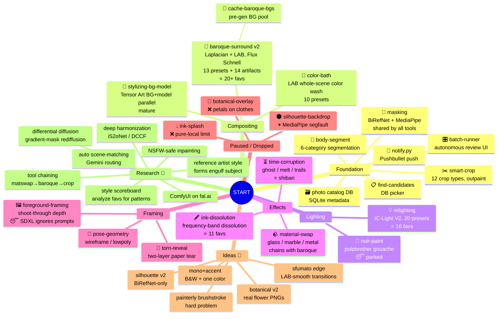

# OpenClaw Tools Mindmap

```mermaid
mindmap
  root((START))
    Foundation
      🔧 masking<br/>BiRefNet + MediaPipe<br/>shared by all tools
      🔧 body-segment<br/>6-category segmentation
      🔧 notify.py<br/>Pushbullet push
      🗃️ photo catalog DB<br/>SQLite metadata
      📋 find-candidates<br/>DB picker
      ✂️ smart-crop<br/>12 crop types, outpaint
      🎛️ batch-runner<br/>autonomous review UI
    Compositing
      🎨 stylizing-bg-model<br/>Tensor Art BG+model parallel<br/>mature
      🎨 baroque-surround v2<br/>Laplacian + LAB, Flux Schnell<br/>13 presets + 14 artifacts<br/>⭐ 20+ favs
        💾 cache-baroque-bgs<br/>pre-gen BG pool
      🎨 color-bath<br/>LAB whole-scene color wash<br/>10 presets
    Lighting
      💡 relighting<br/>IC-Light V2, 20 presets<br/>⭐ 16 favs
      🖤 noir-paint<br/>pulpbrother gouache<br/>😴 parked
    Effects
      ⏳ time-corruption<br/>ghost / melt / trails<br/>⭐ shibari
      🖋️ ink-dissolution<br/>frequency-band dissolution<br/>⭐ 11 favs
      🪨 material-swap<br/>glass / marble / metal<br/>chains with baroque
    Framing
      🖼️ foreground-framing<br/>shoot-through depth<br/>😴 SDXL ignores prompts
      📄 torn-reveal<br/>two-layer paper tear
      📐 pose-geometry<br/>wireframe / lowpoly
    Paused / Dropped
      🌑 silhouette-backdrop<br/>⏸ MediaPipe segfault
      🌸 botanical-overlay<br/>❌ petals on clothes
      💧 ink-splash<br/>❌ pure-local limit
    Ideas 🔮
      botanical v2<br/>real flower PNGs
      sfumato edge<br/>LAB-smooth transitions
      silhouette v2<br/>BiRefNet-only
      painterly brushstroke<br/>hard problem
      mono+accent<br/>B&W + one color
    Research 💭
      deep harmonization<br/>iS2oNet / DCCF
      differential diffusion<br/>gradient-mask rediffusion
      ComfyUI on fal.ai
      auto scene-matching<br/>Gemini routing
      tool chaining<br/>matswap→baroque→crop
      style scoreboard<br/>analyze favs for patterns
      NSFW-safe inpainting
      reference artist style<br/>forms engulf subject
```
