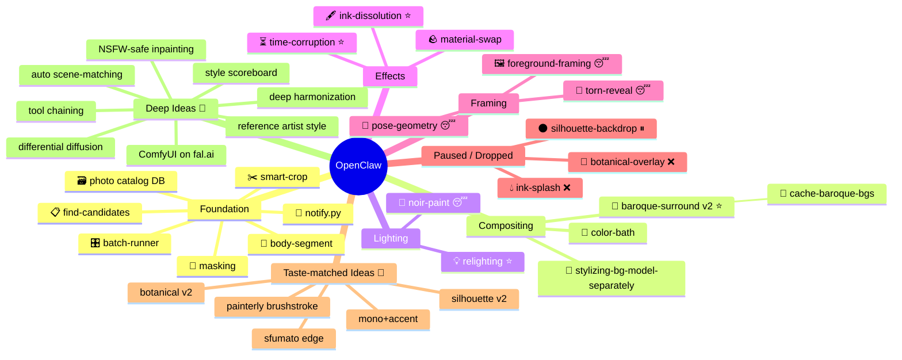

# OpenClaw Tools Mindmap

```mermaid
mindmap
  root((OpenClaw))
    Foundation
      🔧 masking
      🔧 body-segment
      🔧 notify.py
      🗃️ photo catalog DB
      📋 find-candidates
      ✂️ smart-crop
      🎛️ batch-runner
    Compositing
      🎨 stylizing-bg-model-separately
      🎨 baroque-surround v2 ⭐
        💾 cache-baroque-bgs
      🎨 color-bath
    Lighting
      💡 relighting ⭐
      🖤 noir-paint 😴
    Effects
      ⏳ time-corruption ⭐
      🖋️ ink-dissolution ⭐
      🪨 material-swap
    Framing
      🖼️ foreground-framing 😴
      📄 torn-reveal 😴
      📐 pose-geometry 😴
    Paused / Dropped
      🌑 silhouette-backdrop ⏸
      🌸 botanical-overlay ❌
      💧 ink-splash ❌
    Taste-matched Ideas 🔮
      botanical v2
      sfumato edge
      silhouette v2
      painterly brushstroke
      mono+accent
    Deep Ideas 💭
      deep harmonization
      differential diffusion
      ComfyUI on fal.ai
      auto scene-matching
      tool chaining
      style scoreboard
      NSFW-safe inpainting
      reference artist style
```
