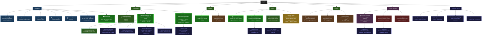

# OpenClaw Tools Tree — Org-chart View

```mermaid
graph TD
    classDef happy fill:#1a6b1a,stroke:#4f4,color:#fff,stroke-width:3px
    classDef done fill:#2d5a1e,stroke:#4a9,color:#fff
    classDef wip fill:#8a6d1b,stroke:#fc3,color:#fff
    classDef tired fill:#5a3a1e,stroke:#a86,color:#ccc
    classDef paused fill:#4a2a4a,stroke:#a6a,color:#ccc
    classDef dropped fill:#5a1e1e,stroke:#a44,color:#ccc,stroke-dasharray:5 5
    classDef idea fill:#1a1a3a,stroke:#66f,color:#99f
    classDef foundation fill:#1a3a5a,stroke:#48c,color:#fff
    classDef root fill:#222,stroke:#fff,color:#fff,stroke-width:3px

    START[START]:::root

    START --> FOUNDATION[Foundation]:::foundation
    START --> COMPOSITING[Compositing]:::done
    START --> LIGHTING[Lighting]:::done
    START --> EFFECTS[Effects]:::done
    START --> FRAMING[Framing]:::done
    START --> INACTIVE[Paused / Dropped]:::paused
    START --> RESEARCH[Research / Ideas]:::idea

    %% Foundation
    FOUNDATION --> MASK["🔧 masking<br/>BiRefNet + MediaPipe<br/>shared by all tools"]:::foundation
    FOUNDATION --> SEGMENT["🔧 body-segment<br/>6-category segmentation"]:::foundation
    FOUNDATION --> NOTIFY["🔧 notify.py<br/>Pushbullet push"]:::foundation
    FOUNDATION --> PHOTODB["🗃️ photo catalog DB<br/>SQLite metadata"]:::foundation
    FOUNDATION --> CAND["📋 find-candidates<br/>DB picker"]:::foundation
    FOUNDATION --> CROP["✂️ smart-crop<br/>12 crop types, dual panel<br/>⚡ outpaint still weak"]:::foundation
    FOUNDATION --> BATCHRUN["🎛️ batch-runner<br/>Autonomous review UI<br/>$2/hr cap, schnell + BG cache"]:::happy

    %% Compositing
    COMPOSITING --> STYLIZE["🎨 stylizing-bg-model<br/>Tensor Art BG+model parallel<br/>mature"]:::done
    COMPOSITING --> BAROQUE["🎨 baroque-surround v2<br/>Laplacian + LAB, Flux Schnell<br/>13 presets + 14 artifacts<br/>⭐ 20+ favs — top tool"]:::happy
    COMPOSITING --> COLORBATH["🎨 color-bath<br/>LAB whole-scene color wash<br/>10 presets — red-film, ochre, teal<br/>🆕 2026-04-17, pure local"]:::happy

    BAROQUE --> BGCACHE["💾 cache-baroque-bgs<br/>Pre-gen BG pool for reuse"]:::done
    BAROQUE --> I_REFARTIST["🔮 reference artist style<br/>Forms engulf subject<br/>Original goal — 80% there"]:::idea
    BAROQUE --> I_HARMONIZE["💭 deep harmonization<br/>iS2oNet / DCCF neural nets"]:::idea
    BAROQUE --> I_PAINTER["🔮 painterly brushstroke<br/>Actually looks like paint<br/>Hard — noir-paint + Impasto miss"]:::idea
    BAROQUE --> I_SCENEMATCH["💭 auto scene-matching<br/>Gemini → preset routing"]:::idea
    COLORBATH --> I_SFUMATO["🔮 sfumato edge<br/>LAB-smooth edge transitions<br/>Post-process for any tool"]:::idea

    %% Lighting
    LIGHTING --> RELIGHT["💡 relighting<br/>IC-Light V2, 20 presets<br/>⭐ 16 favs"]:::happy
    LIGHTING --> NOIR["🖤 noir-paint<br/>Pulpbrother gouache<br/>😴 parked"]:::tired

    %% Effects
    EFFECTS --> TIMECORR["⏳ time-corruption<br/>ghost / melt / trails / glitch<br/>⭐ ghost-dissolve + shibari"]:::happy
    EFFECTS --> INKDISS["🖋️ ink-dissolution<br/>Frequency-band dissolution<br/>⭐ 11 favs — ink-wash"]:::happy
    EFFECTS --> MATSWAP["🪨 material-swap<br/>glass / marble / metal<br/>chains with baroque"]:::done
    EFFECTS --> MOTIONSTREAK["🌀 motion-streak<br/>0010x0010 B&W aesthetic<br/>streak / slitscan / limb-streak modes<br/>⚡ WIP — intensity tuning"]:::wip
    MATSWAP --> I_CHAIN["💭 tool chaining<br/>matswap→baroque→crop one cmd"]:::idea
    INKDISS --> I_MONO["🔮 mono+accent<br/>B&W + single rose / lily<br/>Like refs #8, #16"]:::idea

    %% Framing
    FRAMING --> FGFRAME["🖼️ foreground-framing<br/>Shoot-through depth<br/>😴 SDXL ignores prompts"]:::tired
    FRAMING --> TORN["📄 torn-reveal<br/>Paper tear two-layer<br/>😴 mostly done"]:::tired
    FRAMING --> GEOM["📐 pose-geometry<br/>Wireframe / lowpoly / crystal<br/>😴 rarely used"]:::tired

    %% Inactive
    INACTIVE --> SILH["🌑 silhouette-backdrop<br/>Silhouette on graphic backdrop<br/>⏸ MediaPipe+BiRefNet segfault"]:::paused
    INACTIVE --> BOTAN["🌸 botanical-overlay<br/>Procedural flowers on skin<br/>❌ petals land on clothes"]:::dropped
    INACTIVE --> INKSPL["💧 ink-splash<br/>Posterize + drips on skin<br/>❌ pure-local limit"]:::dropped
    SILH --> I_SILH2["🔮 silhouette v2<br/>BiRefNet-only filter<br/>No MediaPipe (no segfault)"]:::idea
    BOTAN --> I_BOTAN2["🔮 botanical v2<br/>Real flower PNGs on skin<br/>Nude-filter required"]:::idea

    %% Research
    RESEARCH --> I_DIFFDIFF["💭 differential diffusion<br/>Gradient-mask rediffusion"]:::idea
    RESEARCH --> I_COMFYUI["💭 ComfyUI on fal.ai<br/>Custom SD pipelines"]:::idea
    RESEARCH --> I_NSFW["💭 NSFW-safe inpainting<br/>SDXL uncensored or ComfyUI"]:::idea
    RESEARCH --> I_SCOREBOARD["💭 style scoreboard<br/>Analyze favs for patterns"]:::idea
```
